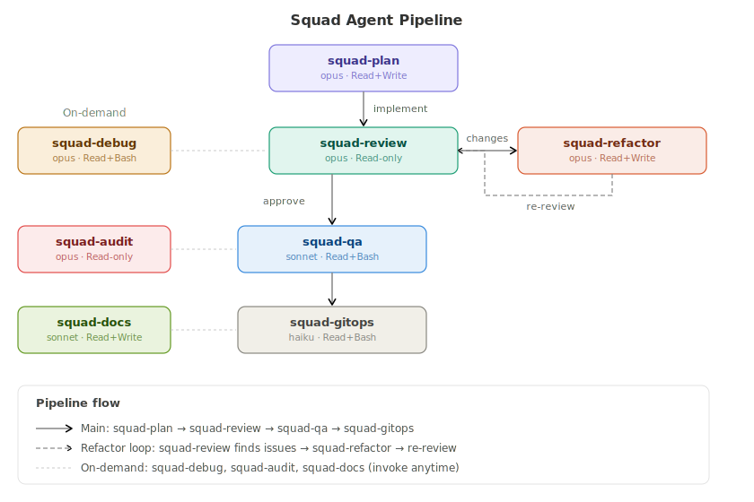

# Squad Agent

**[English](README.md)** | **[한국어](README.ko.md)**

**Claude Code sub-agent system with 8 specialized agents for automated development workflows.**



---

## Quick Start

### Option 1: One-line Install (curl)

```bash
curl -sL https://raw.githubusercontent.com/claude-code-expert/subagents/main/install.sh | bash
```

### Option 2: Clone & Install

```bash
git clone https://github.com/claude-code-expert/subagents.git
cd subagents
bash install.sh
```

### Option 3: Download Release

Download the latest `squad-agents-vX.Y.Z.tar.gz` from the [Releases](https://github.com/claude-code-expert/subagents/releases) page.

```bash
tar xzf squad-agents-v*.tar.gz
bash install.sh
```

### After Install

1. **Restart Claude Code**
2. Run `/agents` to verify registration
3. Try `/squad-review` to start

---

## Agents

| Agent | Role | Model | Tools |
|-------|------|-------|-------|
| `squad-review` | Code review | opus | Read, Bash, Glob, Grep |
| `squad-plan` | Planning & wireframes | opus | Read, Write, Edit, Bash, Glob, Grep |
| `squad-refactor` | Refactoring | opus | Read, Write, Edit, Bash, Glob, Grep |
| `squad-qa` | Testing & QA | sonnet | Read, Bash, Glob, Grep |
| `squad-debug` | Debugging | opus | Read, Bash, Glob, Grep |
| `squad-docs` | Documentation | sonnet | Read, Write, Edit, Glob, Grep |
| `squad-gitops` | Git automation | haiku | Read, Bash, Glob, Grep |
| `squad-audit` | Security audit | opus | Read, Bash, Glob, Grep |

---

## Pipeline

The core pipeline chains agents automatically:

```
squad-plan → [implement] → squad-review → squad-qa → squad-gitops
                               │    ▲
                               │    │
                               ▼    │
                          squad-refactor
                           (if changes requested)
```

**On-demand agents** can be invoked anytime:

- `squad-debug` — Root cause analysis
- `squad-audit` — Security scanning
- `squad-docs` — Documentation generation

### Pipeline Hooks

`install.sh` automatically registers `SubagentStart` and `SubagentStop` hooks in `~/.claude/settings.json`.

- **SubagentStart** — OS notification + sound when a squad agent starts
- **SubagentStop** — OS notification with next pipeline step

> **Note**: Claude Code is a TUI app — `stdout`/`stderr` from SubagentStart/Stop hooks are not displayed in the terminal. The hook uses OS-native notifications instead. See [Notifications](#notifications) for details.

If `jq` is not installed, add manually to `~/.claude/settings.json`:

```jsonc
{
  "hooks": {
    "SubagentStart": [{ "matcher": "", "hooks": [{ "type": "command", "command": "zsh ~/.claude/hooks/subagent-chain.sh" }] }],
    "SubagentStop":  [{ "matcher": "", "hooks": [{ "type": "command", "command": "zsh ~/.claude/hooks/subagent-chain.sh" }] }]
  }
}
```

### Subagent Verification

All 8 agents are verified to run as independent sub-agents (`isSidechain: true`) with correct model routing:

| Agent | isSidechain | Model Applied |
|-------|-------------|---------------|
| squad-review | `true` | opus |
| squad-plan | `true` | opus |
| squad-refactor | `true` | opus |
| squad-qa | `true` | sonnet |
| squad-debug | `true` | opus |
| squad-docs | `true` | sonnet |
| squad-gitops | `true` | haiku |
| squad-audit | `true` | opus |

Each agent gets a unique `agentId`, separate transcript file, and isolated execution context managed by Claude Code internally.

---

## Notifications

When a squad agent starts or completes, the hook sends an **OS-native notification** with sound. This works across macOS, Linux, and Windows (WSL).

### What you'll see

| Event | Notification Title | Notification Body | Sound |
|-------|---------------------|-------------------|-------|
| Agent starts | 🚀 Squad: `{agent}` | Status: RUNNING | Pop (macOS) / message.oga (Linux) |
| Agent completes | ✅ Squad: `{agent}` | COMPLETED → next step | Glass (macOS) / message.oga (Linux) |

**Example**: When running `/squad-review`:

```
🚀 Squad: review          →  ✅ Squad: review
"Status: RUNNING"             "COMPLETED → /squad-refactor or /squad-qa"
```

### Platform Support

| Platform | Notification | Sound | Requirement |
|----------|-------------|-------|-------------|
| **macOS** | `osascript` (Notification Center) | `afplay` (Pop.aiff / Glass.aiff) | Built-in |
| **Linux** | `notify-send` (libnotify) | `paplay` or `aplay` | `sudo apt install libnotify-bin` |
| **Windows (WSL)** | PowerShell popup | — | WSL auto-detected |
| **Windows (native)** | PowerShell popup | — | Git Bash / MSYS2 |

### Customizing Notifications

#### Disable notifications

Remove the hook entries from `~/.claude/settings.json`:

```bash
# Using jq
jq 'del(.hooks.SubagentStart, .hooks.SubagentStop)' ~/.claude/settings.json > tmp.json && mv tmp.json ~/.claude/settings.json
```

Or manually delete the `SubagentStart` and `SubagentStop` keys from the `hooks` object.

#### Disable sound only

Edit `~/.claude/hooks/subagent-chain.sh` and comment out the `play_sound` lines:

```bash
# play_sound "Pop"    # comment out to disable start sound
# play_sound "Glass"  # comment out to disable stop sound
```

#### Change sound

**macOS**: Available sounds are in `/System/Library/Sounds/`:

```
Basso.aiff    Blow.aiff    Bottle.aiff    Frog.aiff    Funk.aiff
Glass.aiff    Hero.aiff    Morse.aiff     Ping.aiff    Pop.aiff
Purr.aiff     Sosumi.aiff  Submarine.aiff Tink.aiff
```

Edit the `play_sound` function in `~/.claude/hooks/subagent-chain.sh` to change sounds.

**Linux**: Default sounds use freedesktop paths. Point to any `.oga` or `.wav` file:

```bash
paplay /path/to/your/sound.oga
```

#### Notification only for specific agents

Edit the agent filter in `~/.claude/hooks/subagent-chain.sh`:

```bash
# Default: all squad agents
case "$AGENT_NAME" in squad-*) ;; *) exit 0 ;; esac

# Example: only review and audit
case "$AGENT_NAME" in squad-review|squad-audit) ;; *) exit 0 ;; esac
```

#### Use a different notification tool

You can replace the `notify()` function in `~/.claude/hooks/subagent-chain.sh`. Examples:

```bash
# Slack webhook
curl -s -X POST "$SLACK_WEBHOOK_URL" -d "{\"text\":\"${title}: ${body}\"}" &

# ntfy.sh (self-hosted or public)
curl -s -d "${body}" "ntfy.sh/my-squad-topic" &

# terminal-notifier (macOS, more options)
terminal-notifier -title "${title}" -message "${body}" -sound default &
```

---

## Commands

| Command | Example |
|---------|---------|
| `/squad-review` | `/squad-review src/auth/` |
| `/squad-plan` | `/squad-plan payment system` |
| `/squad-refactor` | `/squad-refactor src/utils/` |
| `/squad-qa` | `/squad-qa` |
| `/squad-debug` | `/squad-debug TypeError: Cannot read...` |
| `/squad-docs` | `/squad-docs readme` |
| `/squad-gitops` | `/squad-gitops pr` |
| `/squad-audit` | `/squad-audit` |
| `/squad` | `/squad review src/auth/` (universal) |

---

## Usage Examples

### New Feature

```
/squad-plan user profile editing       → Planning
[implement]                            → Write code
/squad-review                          → REQUEST_CHANGES
/squad-refactor src/profile/           → Refactor
/squad-review                          → APPROVE
/squad-qa                              → PASS
/squad-audit src/auth/                 → Security check
/squad-gitops pr                       → Create PR
```

### Production Bug

```
/squad-debug "TypeError: Cannot read properties of undefined"
[fix]
/squad-qa → /squad-gitops commit
```

### Legacy Cleanup

```
/squad-review src/legacy/              → Identify issues
/squad-refactor src/legacy/utils/      → Refactor
/squad-qa                              → Regression test
/squad-docs readme                     → Update docs
```

---

## Model Routing

| Agent | Model | Why |
|-------|-------|-----|
| squad-review | opus | Security & logic require deep reasoning |
| squad-plan | opus | Architecture & edge case design |
| squad-refactor | opus | Safe structural transformation |
| squad-qa | sonnet | Test execution & result formatting |
| squad-debug | opus | Root cause analysis |
| squad-docs | sonnet | Code-to-documentation |
| squad-gitops | haiku | Pattern work, cost-optimized |
| squad-audit | opus | Security — can't afford to miss |

Override globally: `export CLAUDE_CODE_SUBAGENT_MODEL=sonnet`

---

## Project Override

Place `.claude/agents/squad-review.md` in your project to override the global version:

```markdown
---
name: squad-review
description: >
  Expert code review for MyProject.
tools: Read, Bash, Glob, Grep
model: opus
---

## MyProject Rules
- TypeScript `any` PROHIBITED
- All API responses must use Result type
...
```

---

## Uninstall

```bash
bash install.sh --uninstall
```

This removes only Squad Agent files from `~/.claude/`. Backup files (`.bak`) are preserved. Hook entries in `settings.json` must be removed manually.

---

## Architecture

For detailed architecture documentation, see [docs/ARCHITECTURE.md](docs/ARCHITECTURE.md).

---

## Contributing

See [CONTRIBUTING.md](CONTRIBUTING.md) for guidelines on adding new agents or improving existing ones.

---

## License

[Apache License 2.0](LICENSE)

---

## References

- [Claude Code Sub-agents (Official)](https://docs.anthropic.com/en/docs/claude-code/sub-agents)
- [Claude Agent SDK](https://docs.anthropic.com/en/docs/agents/agent-sdk)
- [shanraisshan/claude-code-best-practice](https://github.com/shanraisshan/claude-code-best-practice)
- [VoltAgent/awesome-claude-code-subagents](https://github.com/VoltAgent/awesome-claude-code-subagents)
